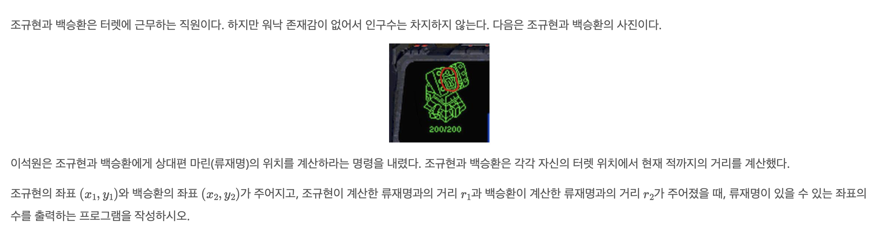
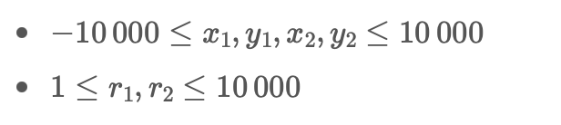

# 터렛

| 시간 제한 | 메모리 제한 | 제출    | 정답   | 맞힌 사람 | 정답 비율  |
|----------|------------|---------|--------|----------|-----------|
|2 초|128 MB|229830|51790|40052|22.709%|

# 문제



# 입력
```
첫째 줄에 테스트 케이스의 개수 $T$가 주어진다. 각 테스트 케이스는 다음과 같이 이루어져 있다.
한 줄에 공백으로 구분 된 여섯 정수 x_1, y_1, r_1, x_2, y_2, r_2가 주어진다.
```

# 출력
```
각 테스트 케이스마다 류재명이 있을 수 있는 위치의 수를 출력한다. 만약 류재명이 있을 수 있는 위치의 개수가 무한대일 경우에는 -1 출력한다.
```

# 제한


# 예제 입력
```
3
0 0 13 40 0 37
0 0 3 0 7 4
1 1 1 1 1 5
```

# 예제 출력
```
2
1
0
```

