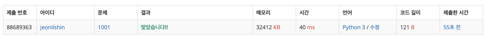

# A - B

### Explanation

1. ```input()```:
    - Reads a line of input as a string.
    - For example, if the input is ```"1 2"```, ```input()``` returns ```"1 2"``` and if the input is ```"12"``` it returns ```"12"```

2. ```split()```:
    - Splits the string into a list of substrings based on spaces.
    - ```"1 2".split()``` → ```["1", "2"].```

3. ```map(int, ...)```:
    - Converts each element in the list to an integer.
    - ```map(int, ["1", "2"])``` → ```[1, 2].```

4. ```print()```:
    - Outputs the result.

