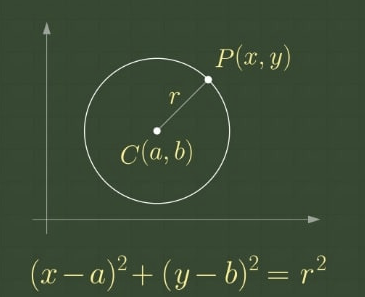
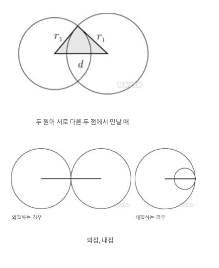

# Turret

### Explanation

1. **Overall Explanation of the Code**  
This problem involves calculating the number of possible locations where the target can be, given the distances from two turrets to the target. The solution utilizes the geometric relationship between two circles. Each turret is treated as the center of a circle, with the distance to the target as the radius. By combining these two circles, the target's possible locations can be determined.  

2. **Using the Circle Equation to Calculate the Distance Between Two Turrets**  

```python
x1, y1, r1, x2, y2, r2 = map(int, input().split())
distance = math.sqrt((x1 - x2)**2 + (y1 - y2)**2)  # Distance between two centers using circle equations
```

### Explanation:
- The two turrets' positions are given as \((x_1, y_1)\) and \((x_2, y_2)\), along with their respective distances to the target (\(r_1\) and \(r_2\)). These inputs are assigned to the variables `x1`, `y1`, `r1`, `x2`, `y2`, and `r2`.
- **Why the circle equation?**
  - Each turret can be visualized as the center of a circle, where the distance to the target forms the circle's radius.
  - The target lies on the circumference of both circles. Therefore, the relationship between the two turrets can be analyzed geometrically using the circle equation and the Euclidean distance formula.
- **How is the distance calculated?**
  - The distance between two points in a 2D plane is derived from the Pythagorean theorem:
    \[
    d = \sqrt{(x_2 - x_1)^2 + (y_2 - y_1)^2}
    \]
    This formula calculates the straight-line distance between the centers of the two circles.

### Interpretation:
By calculating the distance between the two turrets, we can determine their positional relationship (overlap, touch, or separation) and analyze the possible intersections of the two circles:
- If \(d\) (the distance) is less than, equal to, or greater than the sum of their radii (\(r_1 + r_2\)) or the absolute difference of their radii (\(|r_1 - r_2|\)), we can classify the relationship.

This distance forms the basis for determining how many points of intersection exist between the circles.



### 3. **Determine the Number of Intersection Points Using the Center Distance and Positional Relationship of Two Circles**

The conditions for determining the number of intersection points are implemented using conditional statements based on the positional relationship between the circles:

```python
if distance == 0 and r1 == r2:  # The circles are concentric and have the same radius
    print(-1)
elif abs(r1 - r2) == distance or r1 + r2 == distance:  # The circles are tangent (internally or externally)
    print(1)
elif abs(r1 - r2) < distance < (r1 + r2):  # The circles intersect at two distinct points
    print(2)
else:
    print(0)  # Otherwise, the circles do not intersect
```

#### Explanation:
- **Case 1: \(d = 0\) and \(r_1 = r_2\):**
  - The circles are concentric (same center) and have the same radius. This results in infinite intersection points because the circles completely overlap. Output: \(-1\).

- **Case 2: \(|r_1 - r_2| = d\) or \(r_1 + r_2 = d\):**
  - If the absolute difference of the radii equals the distance (\(|r_1 - r_2| = d\)), one circle is internally tangent to the other.
  - If the sum of the radii equals the distance (\(r_1 + r_2 = d\)), the circles are externally tangent.
  - In both cases, the circles touch at exactly one point. Output: \(1\).

- **Case 3: \(|r_1 - r_2| < d < r_1 + r_2\):**
  - The distance is greater than the absolute difference of the radii and less than their sum, meaning the circles intersect at exactly two distinct points. Output: \(2\).

- **Case 4: Otherwise:**
  - If none of the above conditions are met:
    - The circles are either too far apart (\(d > r_1 + r_2\)) and do not touch, or one circle is completely inside the other without touching (\(d < |r_1 - r_2|\) and \(r_1 \neq r_2\)).
  - In these cases, there are no intersection points. Output: \(0\).

---

### 4. **Positional Relationship of Two Circles (from Naver Knowledge Encyclopedia)**

To determine the relationship between two circles:
1. **Define \(d\)**: The distance between the centers of the two circles.
2. **Compare \(d\) with \(|r_1 - r_2|\) and \(r_1 + r_2\):**
   - \(r_1 + r_2 < d\): The circles are completely separate and do not intersect (external).
   - \(r_1 + r_2 = d\): The circles are externally tangent, touching at one point.
   - \(|r_1 - r_2| < d < r_1 + r_2\): The circles intersect at two distinct points.
   - \(|r_1 - r_2| = d\): The circles are internally tangent, touching at one point.
   - \(|r_1 - r_2| > d\) and \(r_1 \neq r_2\): One circle is entirely inside the other without touching.

---

### Why This Method Works:
This approach directly leverages geometric relationships between two circles, which are well-understood and mathematically proven. By simply comparing \(d\) to \(|r_1 - r_2|\) and \(r_1 + r_2\), we can deduce how the circles interact and the number of intersection points. 

The solution avoids unnecessary computations and directly applies the rules of circle geometry. This clarity ensures the logic is both simple to understand and efficient to execute.

